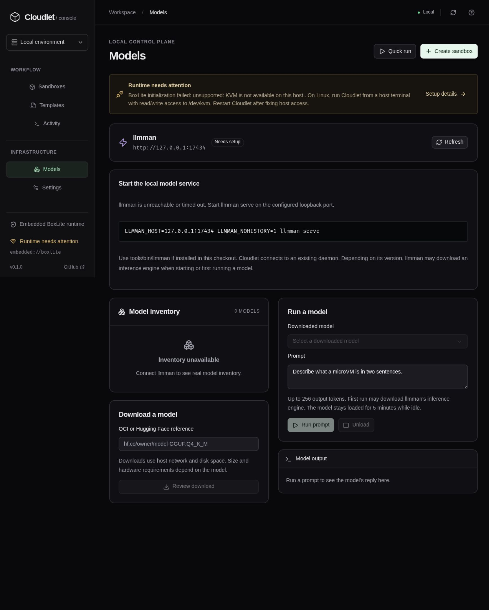
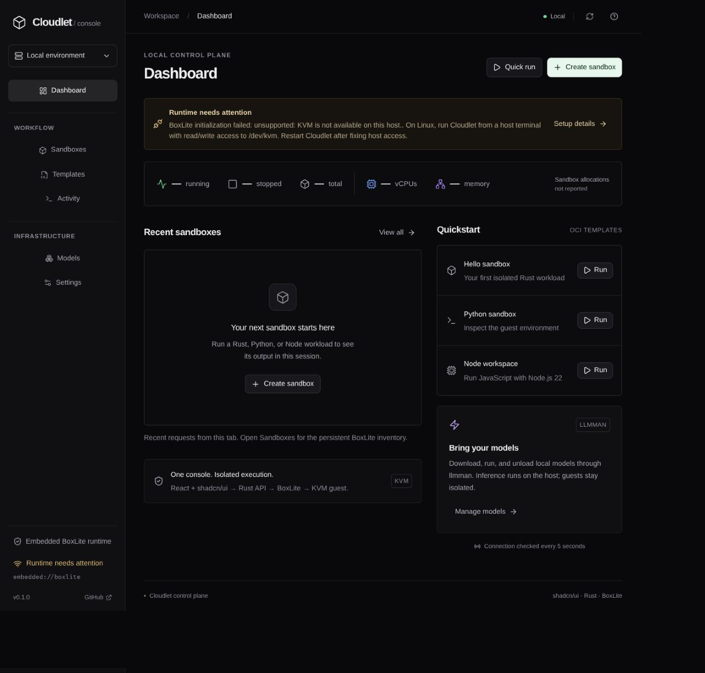
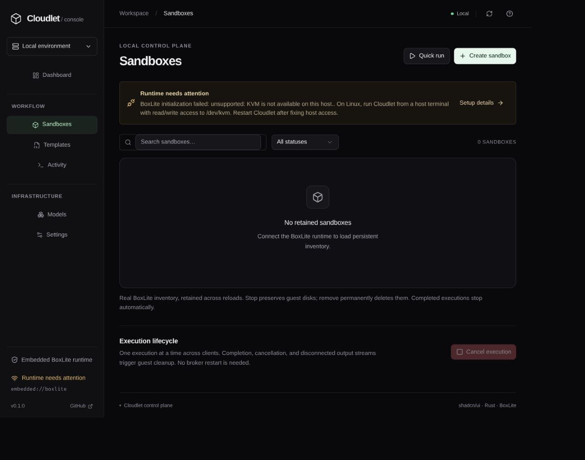
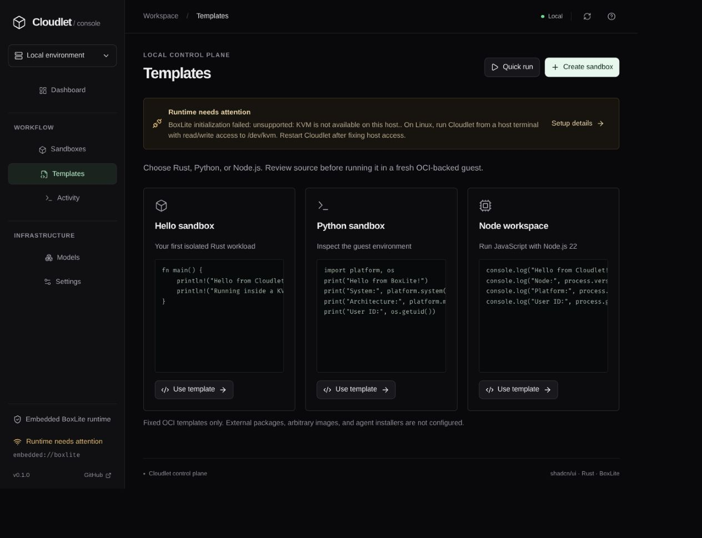
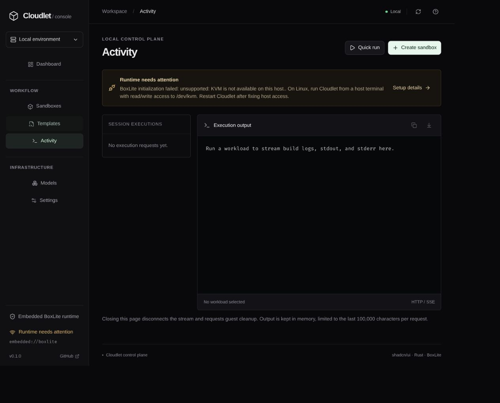
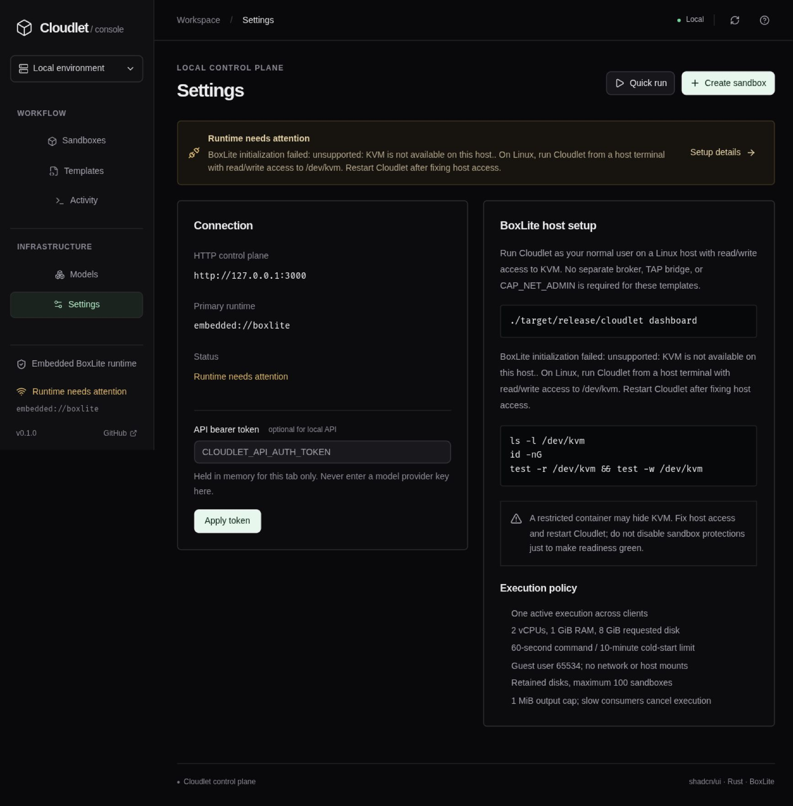

# Cloudlet + BoxLite

A local sandbox console: React, TypeScript, shadcn/ui, and a Rust API with
**BoxLite 0.10.0 as its only sandbox runtime**. The Models page connects
to **llmman** for local model inventory, downloads, prompt execution, and unloading.



## Build and run

Build prerequisites: current Rust, Node.js 22.12+ with npm, C/C++ tools,
pkg-config, and protoc (for BoxLite's internal guest protocol). Cargo downloads BoxLite's official platform runtime
bundle on the first build. Cargo's offline flag does not prevent downloads
performed by BoxLite's build script.

```sh
npm --prefix frontend ci
npm --prefix frontend run build
cargo build --release -p cloudlet
./target/release/cloudlet doctor
./target/release/cloudlet dashboard
```

Open [the console](http://127.0.0.1:3000/). No Node.js, separate broker,
frontend directory, kernel build, FUSE rootfs builder, or CAP_NET_ADMIN is
needed at runtime for these templates. One executable is distributed, not one
process: BoxLite extracts helpers/firmware and stores OCI images and guest disks.
Optional model inference uses a separately installed llmman daemon and its
inference-engine subprocesses; those are not embedded in the Cloudlet executable.

## Run local models with llmman

Install [llmman from its official project](https://github.com/llmmanorg/llmman#install),
or use an existing installation. Start it in a separate host terminal:

```sh
LLMMAN_HOST=127.0.0.1:17434 \
LLMMAN_NOHISTORY=1 \
LLMMAN_PEERS='' \
LLMMAN_CONTEXT_LENGTH=4096 \
LLMMAN_MAX_LOADED_MODELS=1 \
llmman serve
```

If installed in this checkout, substitute `./tools/bin/llmman` for `llmman`.
Keep it on loopback: **llmman's own daemon has no authentication**. Cloudlet's
auth protects Cloudlet routes, not direct access to llmman's port. Do not expose
the daemon to a LAN or use this configuration as a multi-user isolation boundary.

Depending on its version, llmman downloads a compatible inference engine at
startup or first use. To use existing files only, put an already-installed
`llama-server` on `PATH` first and use a store containing existing models. Set
`LLMMAN_MODELS=/absolute/path/to/existing/store` before starting llmman to select
that store. Do not confuse an OCI model store with a single GGUF file; see
[llmman's model packaging instructions](https://github.com/llmmanorg/llmman).

In Cloudlet, open **Models**:

1. Check the daemon connection and model inventory, including loaded models.
2. Select a downloaded model, enter a prompt, and choose **Run prompt**.
3. Read its reply under **Model output**. **Unload** asks llmman to release the
   model; weights remain on disk. Otherwise idle models expire after five minutes.
4. To add weights later, enter an OCI/Hugging Face reference, choose **Review
   download**, and confirm the download. Nothing is pulled merely by opening a page.

This console exposes text generation, not every llmman backend/API. Hardware,
format, available memory, and engine compatibility determine which models run.
GPU setup, provider configuration, model deletion, and importing arbitrary files
are not performed by Cloudlet. Prompts are limited to 8 KiB and replies to 256
generated tokens / 1 MiB of upstream response data. A model may finish without a
text reply (for example, a reasoning model reaching the token limit).

Model operations are separate from the BoxLite execution queue. One model
operation is admitted per Cloudlet process; other llmman clients remain outside
that limit. Pulls have a 30-minute timeout, generation/unload ten minutes. Progress
is parsed as bounded NDJSON frames; API state survives changing pages but only the
latest operation is held in memory. There is no Cloudlet download-cancel button.
Closing the tab or losing a connection does not prove upstream work stopped. An
**unconfirmed** result blocks more model operations: check llmman's terminal and
processes, then restart Cloudlet only after confirming the daemon is idle.

Inference runs **on the host, not in a BoxLite guest**. Guest networking is still
disabled. Cloudlet uses a fixed loopback URL, disables HTTP redirects/proxies,
and sends llmman's node-local hop header to avoid aggregation-peer forwarding.
No browser Authorization header or provider key is forwarded. Hosted providers
and guest-to-model access are not exposed. `LLMMAN_NOHISTORY=1` disables llmman's
prompt log; browser output and Cloudlet's latest operation stay in memory.

See the upstream [HTTP API](https://github.com/llmmanorg/llmman/blob/main/docs/api.md)
and [configuration](https://github.com/llmmanorg/llmman/blob/main/docs/configuration.md).

## Linux setup

Run as your ordinary user with read/write access to /dev/kvm. BoxLite performs
a real KVM smoke test at initialization. From a normal host terminal:

```sh
ls -l /dev/kvm
id -nG
test -r /dev/kvm && test -w /dev/kvm
./target/release/cloudlet doctor
```

If missing, check firmware virtualization and the appropriate KVM kernel module.
If the device is owned by group kvm, an administrator can add your user to that
group; log out and back in. Do not make KVM world-writable or run the console
as root. Restricted containers may hide KVM even when the host supports it.
Use a host terminal or an explicitly device-enabled environment; do not bypass
no_new_privs. Restart Cloudlet after fixing access.

The UI stays available if runtime initialization fails and shows diagnostics.
Initialization readiness is not proof of OCI guest boot; the execution stream
reports when that happens.

## Runtime policy

- Fixed OCI templates: Rust 1.90, Python 3.13, Node.js 22 on Debian Bookworm.
- Guest execution as UID/GID 65534. No host mounts, credentials, or published ports.
- Guest ingress and egress disabled. Host-side OCI pulls still need Internet access.
- BoxLite default jailer/seccomp/namespaces enabled, never silently disabled.
- Two vCPUs, 1024 MiB RAM, 8 GiB requested sparse guest disk. This is not a strict
  host disk quota: the base image can require a larger disk.
- One execution across clients; 60-second command / 10-minute cold-start deadline.
- Application output cap 1 MiB and bounded SSE queue; slow consumers cancel.
  The SDK has internal buffering, so this is not a hard host-memory quota.
- Completion, cancellation, disconnect, or timeout triggers guest stop.
  Cleanup failure blocks another execution until resolved.
- Retained stopped disks and persistent metadata; at most 100 sandboxes.
  Remove deletes a stopped guest disk permanently, never force-deleting live boxes.

Image tags are fixed, not immutable digests. Host cgroup enforcement is not
independently verified. This is a local development control plane, not a
reviewed hostile multi-tenant execution service.

## Configuration

| Variable | Default / purpose |
| --- | --- |
| CLOUDLET_API_HOST | 127.0.0.1 |
| CLOUDLET_API_PORT | 3000 |
| CLOUDLET_BOXLITE_HOME | $XDG_DATA_HOME/cloudlet/boxlite or ~/.local/share/cloudlet/boxlite |
| CLOUDLET_API_AUTH_TOKEN | Optional on loopback; 16+ printable non-space characters |
| CLOUDLET_API_ALLOW_REMOTE | Explicit non-loopback opt-in; also requires a token |
| CLOUDLET_LLMMAN_URL | http://127.0.0.1:17434; HTTP loopback IP only, no credentials/path/query |

One process owns each BoxLite state directory. Do not point Cloudlet at an
unrelated BoxLite store. There is no alternate execution backend or broker.
The browser stores API tokens in tab memory only. Remote
use needs trusted TLS and additional review. Same-origin and loopback Host
guards remain enforced. CSP permits inline styles for Radix positioning/modal
scroll locking, but not inline scripts or eval.

## Console and API

Dashboard metrics report guest allocations, not host capacity. Sandboxes shows
persistent inventory with stop/remove controls. Activity streams preparation,
stdout/stderr, exit status, and cleanup errors. Output history is tab-local;
download before reloading.

| Method | Route | Purpose |
| --- | --- | --- |
| GET | /healthz | Public API/runtime initialization status |
| GET | /api/v1/overview | Authenticated diagnostics and persistent inventory |
| POST | /api/v1/workloads | Rust/Python/Node source execution, SSE |
| POST | /api/v1/sandboxes/{id}/stop | Stop exact sandbox, including another tab's execution |
| DELETE | /api/v1/sandboxes/{id} | Remove stopped sandbox, never force |
| POST | /api/v1/workloads/cancel | Request cancellation of the active BoxLite execution |
| GET | /api/v1/models | Authenticated llmman readiness, local inventory, latest operation |
| POST | /api/v1/models/operations | Start pull/run/unload; returns 202, poll /api/v1/models |

See [API contract](src/api/README.md) for request shapes. Snapshot/clone,
and arbitrary OCI guest image/command execution are not exposed.

## Architecture

```text
cloudlet executable
├── Embedded React + shadcn/ui assets → browser
└── Rust HTTP API ← same-origin requests / bearer policy
    ├── Shared control-plane contracts
    ├── Admission / output / cancellation / cleanup policy
    ├── Embedded BoxLite SDK (only sandbox runtime)
    │   ├── OCI cache + SQLite inventory + retained disks
    │   └── Isolated shim subprocess → libkrun / KVM → OCI guest (no network)
    └── Model adapter → loopback llmman daemon → host inference engine
        └── Local model store + latest operation / reply
```

Frontend primitives live in frontend/src/components/ui. Runtime policy lives
in src/api/src/runtime.rs; HTTP/auth/SSE in service.rs; shared contracts in
src/control-plane; the llmman adapter in src/api/src/models.rs; model controls in
frontend/src/Models.tsx; executable dispatch in src/cloudlet. The workspace
contains only cloudlet, api, control-plane, and the HTTP cli client.

The custom VMM, guest agent, rootfs/kernel build tools, gRPC broker, and privileged
service packaging have been removed. Their source remains in Git history.
The old `legacy-vmm` feature and `vmm-service` command are no longer available.
Clients must use `/api/v1/workloads/cancel` instead of `/api/v1/vmm/shutdown`;
`/healthz` now names its embedded runtime field `runtime_endpoint`.
The `/run` and `/shutdown` HTTP compatibility aliases still use BoxLite only.

## Development and verification

Run the API and npm --prefix frontend run dev in separate terminals. Vite
proxies API calls to port 3000. Rebuild frontend then Rust for release changes.

```sh
npm --prefix frontend test
npm --prefix frontend run build
cargo fmt --all --check
cargo test --workspace
cargo clippy --workspace --all-targets -- -D warnings
```

KVM-independent tests do not replace running templates on a real host.
BoxLite's upstream build script can print informational cargo:warning lines
while embedding assets; these are separate from Cloudlet compiler lints.

Model tests use an explicitly labeled local HTTP fixture for inventory, download
progress, generation, and unload contracts. Fixture replies are never used by the
console or screenshots. A real model-generation smoke test still requires an
existing compatible model and engine; no weights or engine were downloaded for
this documentation capture.

## Screenshots

Captured from the running console on 8 September 2026. These are real empty/setup
states, not fabricated workloads or model replies. The capture environment lacks
KVM access and a running llmman daemon; those diagnostics are intentionally visible.
They do not describe the state of a separate Cloudlet process running on your host.

### Dashboard



### Sandboxes



### Templates



### Activity



### Models


### Settings


