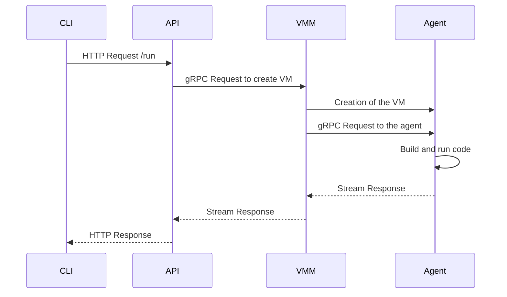

Historical custom VMM instructions — not used by the current BoxLite dashboard.
See the repository README for current setup. Build cloudlet with --features legacy-vmm to retain the old vmm-service role.

<div style="text-align:center">
    <h1> Cloudlet</h1>
    <p>The almost fast FaaS</p>
    
</div>

## Table of Contents

- [Table of Contents](#table-of-contents)
- [Prerequisites](#prerequisites)
- [Run Locally](#run-locally)
  - [Clone the project](#clone-the-project)
  - [Setup](#setup)
  - [Start the VMM](#start-the-vmm)
  - [Run the API](#run-the-api)
  - [Send the request using the CLI](#send-the-request-using-the-cli)
- [Architecture](#architecture)
- [Config file](#config-file)

## Prerequisites

Install the dependencies. On Debian/Ubuntu:

```bash
apt install build-essential cmake pkg-config libssl-dev flex bison libelf-dev iptables
```

Then, configure the Rust toolchain and install [Just](https://github.com/casey/just) (only for dev environment):

```bash
rustup target add x86_64-unknown-linux-musl
cargo install just # optional
```

Finally, install [the protobuf compiler](https://github.com/protocolbuffers/protobuf?tab=readme-ov-file#protobuf-compiler-installation).

## Run Locally

### Clone the project

```bash
git clone https://github.com/virt-do/cloudlet
```

### Setup

Go to the project directory:

```bash
cd cloudlet
```

Create a TOML config file or update the [existing one](./src/cli/examples/config.toml):

```bash
cat << EOF > src/cli/examples/config.toml
workload-name = "fibonacci"
language = "rust"
action = "prepare-and-run"

[server]
address = "localhost"
port = 50051

[build]
source-code-path = "$(readlink -f ./src/cli/examples/main.rs)"
release = true
EOF
```

Make sure to update the `source-code-path` to the path of the source code you want to run.
Use an absolute path.

[Here](#config-file) are more informations about each field

### Start the VMM

The VMM role creates TAP/bridge devices and accesses KVM; it is intentionally
separate from the desktop/API role. Keep it local and give only this process
`CAP_NET_ADMIN` (plus normal access to `/dev/kvm`):

```bash
export CLOUDLET_VMM_AUTH_TOKEN="$(openssl rand -hex 32)"
sudo -E capsh --keep=1 --user="$USER" --inh=cap_net_admin --addamb=cap_net_admin -- -c \
  'RUST_BACKTRACE=1 cargo run --bin vmm -- grpc'
```

The API or desktop process that connects to this VMM needs the same
`CLOUDLET_VMM_AUTH_TOKEN`. For a long-running host, use the restrictive sample
unit in [`packaging/systemd/cloudlet-vmm.service`](./packaging/systemd/cloudlet-vmm.service)
instead of giving capabilities to an interactive desktop process.

### Use any LLM from a workload

Cloudlet starts one host-side [`llmman`](https://github.com/llmmanorg/llmman) daemon for each VMM bridge and exposes its OpenAI-compatible API to guest workloads. Install `llmman` on the VMM host first:

```bash
curl -fsSL https://raw.githubusercontent.com/llmmanorg/llmman/main/install.sh | sh
```

The VMM binds it only to the private bridge (`172.29.0.1:17434`). Workloads receive `CLOUDLET_LLM_BASE_URL` and `OPENAI_BASE_URL`, both set to `http://172.29.0.1:17434/v1`, plus a local `OPENAI_API_KEY` placeholder. Use any local or hosted model name in the OpenAI request's `model` field; `llmman` loads or routes it on demand.

Set `CLOUDLET_LLMMAN_BIN`, `CLOUDLET_LLMMAN_PORT`, or `CLOUDLET_LLMMAN_STARTUP_TIMEOUT_SECS` before starting the VMM to override the binary, bridge port, or startup wait. For hosted providers, set that provider's API key in the VMM host environment before starting it.

### Run Cloudlet as one binary

`cloudlet` is one executable with separate security roles. This preserves a
single installed binary while keeping the React/TypeScript browser console and
HTTP API separate from the VMM's KVM/network privileges. The console follows
AgentKernel's dark management layout, with Cloudlet's own API and capabilities.
There is no native WebView, Dioxus, GTK, or libxdo dependency.

Node.js 22.12+ and npm are required **at build time only**. Build the frontend
first so Cargo can embed its production assets:

```bash
npm --prefix frontend ci
npm --prefix frontend run build
cargo build --release -p cloudlet

# Ordinary user: serves the console and local API.
./target/release/cloudlet dashboard

# Open http://127.0.0.1:3000/ in your browser.

# Privileged service role: launch separately, preferably with systemd.
sudo -E capsh --keep=1 --user="$USER" --inh=cap_net_admin --addamb=cap_net_admin -- -c \
  'RUST_BACKTRACE=1 ./target/release/cloudlet vmm-service'
```

`cloudlet dashboard` is the default command. `cloudlet desktop` remains a
compatibility alias; it now serves the browser console instead of opening a
native window. `cloudlet api` serves the same API and embedded console.
`cloudlet vmm-service` starts only the privileged broker. Startup prints the
actual listening URL and propagates bind errors. Stop the console with Ctrl-C.

Only the compiled binary is needed to serve the UI. Node.js, the frontend
directory, and a second frontend server are not needed at runtime. The VMM
still needs its kernel/rootfs assets and llmman for guest execution.

The console provides live broker connectivity, Rust workload submission,
streamed build/output logs, session history, source templates, and a confirmed
guest shutdown action. Enter `CLOUDLET_API_AUTH_TOKEN` in Settings if configured;
it is held only in the current tab's memory. Never enter a VMM token or provider
key into the browser. The API process still needs the broker's matching
`CLOUDLET_VMM_AUTH_TOKEN` in its own environment.

**Current backend limits:** one guest per broker process; restart the broker
after shutting the guest down. Workload history is tab-local, not a persistent
VM inventory. Resource capacity and model readiness are shown as unavailable,
not fabricated. Snapshots, agent installation, Python/Node execution, and model
management are not exposed by the existing backend. Reloading the page clears
its history and credentials; closing the page does not stop a guest.

For frontend development, run the API in one terminal and
`npm --prefix frontend run dev` in another. Vite prints its local URL and proxies
`/api` to `127.0.0.1:3000`. Production always uses same-origin embedded assets.
Rebuild the frontend **and then the Rust binary** after frontend changes.

```bash
npm --prefix frontend test
npm --prefix frontend run build
cargo test --workspace
```

The host needs `CAP_NET_ADMIN` only when it creates guest networking. If your
environment prevents `sudo` from elevating privileges (for example, a container
with `no_new_privs`), run the VMM role on the host or use a supported privileged
service environment.

### Run the API

```bash
cargo run --bin api
```

The API is the unprivileged control-plane boundary. It binds to `127.0.0.1:3000` by default and exposes:

- `GET /healthz` — API and VMM reachability
- `GET /` — embedded React console
- `GET /api/v1/overview` — dashboard read model
- `POST /api/v1/workloads` — stream a workload execution as SSE
- `POST /api/v1/vmm/shutdown` — request VMM shutdown

The API binds to `127.0.0.1:3000` by default. A non-loopback bind is rejected
unless both `CLOUDLET_API_ALLOW_REMOTE=true` and a 16+-character
`CLOUDLET_API_AUTH_TOKEN` are set. The CLI sends that token automatically when
the same environment variable is present. `CLOUDLET_VMM_AUTH_TOKEN` protects
the API-to-VMM gRPC boundary and is required for the VMM role; remote VMM binds
also require explicit opt-in via `CLOUDLET_VMM_ALLOW_REMOTE=true`. The only
unauthenticated mode is the explicit local-development escape hatch
`CLOUDLET_VMM_ALLOW_UNAUTHENTICATED_LOCAL=true`.

Browser control requests must use the same origin as the API. Cross-site
requests and foreign Host headers to a loopback API are rejected; there is no
permissive CORS configuration. Bearer checks still apply to the CLI. Use TLS
via a trusted deployment setup before sending tokens over a remote network.

Guest egress is disabled by default. Workloads can still reach llmman through
the private bridge; set `CLOUDLET_ALLOW_GUEST_EGRESS=true` only when a workload
explicitly needs Internet access. Each guest agent receives a fresh boot token,
and the agent validates requests, restricts injected environment variables,
bounds source/output, builds and runs workload code as an unprivileged guest
identity, uses private temporary directories, and enforces build and execution
timeouts.

## Architecture

Cloudlet packages all host roles in one executable while retaining a process
boundary where it is essential:

```text
┌────────────────────── cloudlet dashboard / api (unprivileged) ────────────────────────┐
│  Embedded React assets → Browser → API (same-origin HTTP + SSE, bearer policy)       │
└───────────────────────────────────┬──────────────────────────────────────────────────┘
                                    │ local authenticated gRPC
┌───────────────────────────────────▼──────────────────────────────────────────────────┐
│ cloudlet vmm-service (KVM + CAP_NET_ADMIN only) → private bridge → guest agent token │
└───────────────────────────────────────────────────────────────────────────────────────┘
                                               │
                                           llmman bridge
```

- `src/cloudlet`: the one-binary dispatcher for `dashboard`, `api`, and `vmm-service` roles (`desktop` is an alias).
- `src/control-plane`: serialisable contracts shared by the dashboard, CLI, and API.
- `src/api`: configurable, versioned HTTP control plane; it does not own VM internals.
- `src/vmm`: privileged virtual-machine lifecycle, local authenticated broker, and private llmman bridge.
- `src/agent`: authenticated guest-side workload execution with bounded output and cleanup.
- `frontend`: React + TypeScript console, Vite build, reusable API/SSE client and transport tests.
- `src/api/src/frontend.rs`: serves compile-time embedded assets with a restrictive content security policy; no runtime filesystem fallback.

### Send the request using the CLI

```bash
cargo run --bin cli -- run --config-path src/cli/examples/config.toml
```

> [!NOTE]
> If it's your first time running the request, `cloudlet` will have to compile a kernel and an initramfs image.
> This will take a while, so make sure you do something else while you wait...

Here is a simple sequence diagram of Cloudlet:



1. The CLI sends an HTTP request to the API which in turn sends a gRPC request to the VMM
2. The VMM then creates a VM
3. When a VM starts it boots on the agent which holds another gRPC server to handle requests
4. The agent then builds and runs the code
5. The response is streamed back to the VMM and then to the API and finally to the CLI.

## Config file
| Field | Description | Type |
| --- | --- | --- |
| workload-name | Name of the workload you wanna run | String |
| language | Language of the source code | String enum: rust, python node |
| action | Action to perform | String enum: prepare-and-run |
| server.address | Address of the server (currently not used) | String |
| server.port | Port of the server (currently not used) | Integer |
| build.source-code-path | Path to the source code on your local machine | String |
| build.release | Build the source code in release mode | Boolean |
